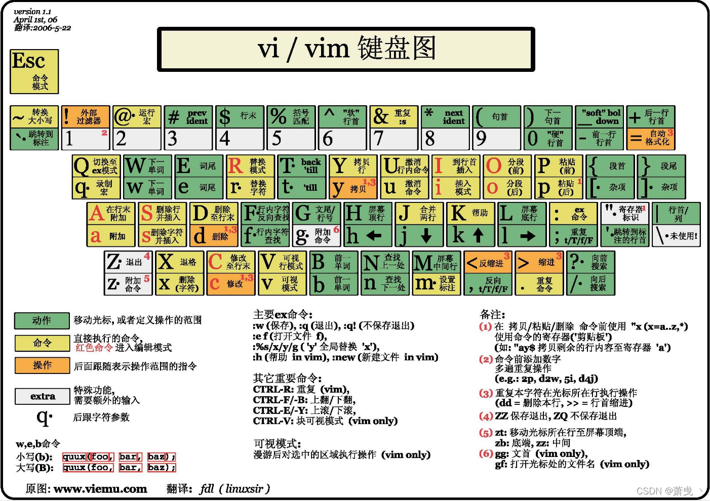

# Linux常用文本编辑器

## Vim

### 基本概念
- 模式切换：普通模式、插入模式、命令模式
- 配置文件：`~/.vimrc`


### 常用操作
```bash
# 启动Vim
vim filename

# 基本命令
i     # 进入插入模式
ESC   # 返回普通模式
:w    # 保存文件
:q    # 退出
:wq   # 保存并退出
:q!   # 强制退出不保存
```

### 进阶功能
1. **搜索与替换**
   - `/pattern`：搜索
   - `:%s/old/new/g`：全局替换

2. **多文件编辑**
   - `:e filename`：打开新文件
   - `:bn`：下一个文件
   - `:bp`：上一个文件

3. **分屏操作**
   - `:sp`：水平分屏
   - `:vsp`：垂直分屏
   - `Ctrl+w`：切换窗口



## Emacs

### 基本概念
Emacs 是一个与 Vim 齐名的强大编辑器，事实上 Emacs 几乎具有 Vim 的所有好处，例如：
- 只需要键盘就可以完成所有操作，大量使用快捷键，具有极高的编辑效率。
- 既可以在终端无图形界面的场景下使用，也可使用有图形界面的版本获得更现代、更美观的体验。
此外，Emacs 与其它大部分编辑器最大的不同就在于其强大的扩展性。

### 常用操作
```bash
# 启动Emacs
emacs filename

# 基本命令
C-x C-f  # 打开文件
C-x C-s  # 保存文件
C-x C-c  # 退出
C-g      # 取消命令
```

### 特色功能
1. **扩展系统**
   - 包管理器
   - 自定义配置

2. **集成开发环境**
   - 代码补全
   - 语法高亮
   - 调试工具

推荐一篇学习博客: https://www.zhihu.com/column/c_1440829147212279808

## Nano

### 特点
- 简单易用
- 适合初学者
- 轻量级

### 常用操作
```bash
# 启动Nano
nano filename

# 基本命令
Ctrl+O  # 保存文件
Ctrl+X  # 退出
Ctrl+W  # 搜索
Ctrl+K  # 剪切行
Ctrl+U  # 粘贴
```

## 编辑器选择建议

### 初学者
- 推荐使用Nano
  - 界面友好
  - 命令简单
  - 有操作提示

### 进阶用户
- 推荐使用Vim
  - 高效编辑
  - 强大的插件系统
  - 广泛使用

### 专业开发
- 推荐使用Emacs
  - 完整的开发环境
  - 强大的扩展能力
  - 高度可定制

## 学习建议
1. 从Nano开始入门
2. 逐步学习Vim基础命令
3. 除非特殊工种，一般记住基础命令就行，开发中遇到只能使用上述编辑器的情况很少。

## 参考资料
- Vim官方文档：https://www.vim.org/docs.php
- Emacs官方文档：https://www.gnu.org/software/emacs/manual/
- Nano官方文档：https://www.nano-editor.org/docs.php 