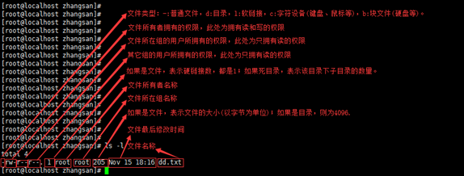

# Linux用户、组与权限管理

## 快速跳转目录
* [一、概念与权限理论](#一概念与权限理论)
* [二、用户与组管理](#二用户与组管理)
  - [useradd](#useradd)
  - [groupadd](#groupadd)
  - [usermod](#usermod)
  - [id](#id)
  - [userdel](#userdel)
  - [groupdel](#groupdel)
* [三、密码与账号策略](#三密码与账号策略)
  - [passwd](#passwd)
  - [chage](#chage)
  - [login.defs](#logindefs)
* [四、权限与所有者管理](#四权限与所有者管理)
  - [chmod](#chmod)
  - [chown](#chown)
  - [chgrp](#chgrp)
* [五、提升/切换身份](#五提升切换身份)
  - [sudo](#sudo)
  - [visudo](#visudo)
  - [su](#su)
* [六、综合实例](#六综合实例)

---

## 一、概念与权限理论

在Linux中，每一个文件和目录都有自己的访问权限，通过文件列表可以查看到。



### 1.1 权限位说明
- 第0位：文件类型（d,-,c,b）
- 第1-3位：所有者权限（User）
- 第4-6位：所属组权限（Group）
- 第7-9位：其他用户权限（Other）

### 1.2 权限含义
- [ r ] 可读(read)：可以读取、查看
- [ w ] 可写(write)：可以修改，但不代表可以删除该文件，删除前提是对所在目录有写权限
- [ x ] 可执行(execute)：可以被执行

#### 权限作用于目录
- [ r ] 可读：ls查看目录内容
- [ w ] 可写：目录内创建、删除、重命名
- [ x ] 可执行：可以进入该目录

#### 权限数字表示法
- r=4(即2²),w=2(即2¹),x=1(即2º)

---

## 二、用户与组管理

### 2.1 命令 `useradd`
#### 基本用法
```bash
useradd -m username              # 创建用户主目录
useradd -r serviceuser           # 创建系统账户（UID < 1000）
useradd -s /usr/bin/zsh username # 指定登录 Shell
useradd -G wheel,developers username  # 加入附加组
useradd -c "描述信息" username        # 添加备注
```
#### 参数说明
- `-m`：创建主目录
- `-r`：系统账户
- `-s`：指定Shell
- `-G`：附加组
- `-c`：备注

#### 使用场景
新建普通用户、系统用户、指定shell或备注。

#### 示例命令
```bash
useradd -m -s /usr/bin/zsh -G developers alice
```

#### 总结
`useradd` 用于灵活创建用户，常配合组和shell参数。

---

#### 什么是"登录 Shell"？
每个用户有默认命令行解释器(shell)，常见有：
| Shell | 路径 | 特点 |
| ----- | ----------------------------- | ----------------------------- |
| Bash  | `/bin/bash` 或 `/usr/bin/bash` | 默认、最常见 |
| Zsh   | `/usr/bin/zsh` | 自动补全强 |
| Sh    | `/bin/sh` | 基本shell，常用于脚本 |
| Fish  | `/usr/bin/fish` | 现代、友好 |
| Dash  | `/bin/dash` | 更快更小，Ubuntu默认sh |
| rbash | `/usr/bin/rbash` | 受限shell |

查看已安装Shell：
```bash
cat /etc/shells
```

显示所有用户：
```bash
cut -d: -f1 /etc/passwd | sort
```

---

### 2.2 命令 `groupadd`
#### 基本用法
```bash
groupadd developers
```
#### 参数说明
- `-g`：指定GID
- `-r`：系统组

显示所有组：
```bash
cut -d: -f1 /etc/group | sort
```

#### 总结
`groupadd` 用于新建用户组，配合GID和系统组参数。

---

### 2.3 命令 `usermod`
#### 基本用法
```bash
usermod -aG sudo username        # -aG：附加用户到 sudo 组（保留原组）
usermod -G audio,video username  # -G：设置用户组列表（覆盖原组）
usermod -l newname oldname       # -l：修改登录名
usermod -d /new/home -m username # -d：更改并移动主目录; -m：移动
usermod -s /bin/bash username    # -s：设置登录 Shell
```
#### 参数说明
- `-aG`：附加组
- `-G`：覆盖组
- `-l`：改名
- `-d`：更改主目录
- `-m`：移动主目录
- `-s`：更改Shell

#### 总结
`usermod` 用于修改用户属性，常用于组、目录、shell调整。

---

### 2.4 命令 `id`
#### 基本用法
```bash
id
id username
id -u username
id -g username
id -G username
id -nG username
```
#### 参数说明
- `-u`：仅UID
- `-g`：仅GID
- `-G`：所有组GID
- `-nG`：组名

#### 总结
`id` 用于查询用户和组信息。

---

### 2.5 命令 `userdel`
#### 基本用法
```bash
userdel username
userdel -r username
```
#### 参数说明
- `-r`：删除主目录和邮件

> 注意：不能删除当前登录用户，删除前建议确认信息，操作不可恢复。

#### 总结
`userdel` 用于安全删除用户。

---

### 2.6 命令 `groupdel`
#### 基本用法
```bash
groupdel groupname
```
> 注意：不能删除仍被用户使用的组，建议先删除相关用户。

#### 总结
`groupdel` 用于删除空用户组。

---

## 三、密码与账号策略

### 3.1 命令 `passwd`
#### 基本用法
```bash
passwd
passwd username
passwd -l username
passwd -u username
passwd -e username
passwd --stdin username < passfile
```
#### 参数说明
- `-l`：锁定账号
- `-u`：解锁账号
- `-e`：强制下次登录修改密码
- `--stdin`：从标准输入读密码

#### 总结
`passwd` 用于密码管理和账号锁定。

---

### 3.2 命令 `chage`
#### 基本用法
```bash
chage -l username
chage -m 1 username
chage -M 90 username
chage -W 7 username
chage -I 30 username
```
#### 参数说明
- `-l`：列出密码信息
- `-m`：最短使用天数
- `-M`：最长使用天数
- `-W`：过期前警告
- `-I`：过期后不可用天数

#### 总结
`chage` 用于密码策略管理。

---

### 3.3 配置文件 `login.defs`
#### 说明
`/etc/login.defs` 定义系统级账号策略：
```text
PASS_MAX_DAYS   90   # 密码最长使用天数
PASS_MIN_DAYS   1    # 密码最短使用天数
PASS_WARN_AGE   7    # 密码即将过期警告天数
UID_MIN         1000 # 普通用户 UID 下限
GID_MIN         1000 # 普通组 GID 下限
```

---

## 四、权限与所有者管理

### 4.1 命令 `chmod`
#### 基本用法
```bash
chmod +x script.sh
chmod 755 script.sh
chmod -R 700 dir/
chmod u+rw,go-w file.txt
chmod a=r file.txt
```
#### 参数说明
- `+x`：添加执行权限
- 数字模式：rwxr-xr-x
- `-R`：递归
- `u/g/o/a`：用户/组/其他/所有

#### 总结
`chmod` 用于灵活设置文件和目录权限。

---

### 4.2 命令 `chown`
#### 基本用法
```bash
chown user:group file.txt
chown user file.txt
chown :group file.txt
chown -R user:group dir/
```
#### 参数说明
- `user:group`：设置所有者和组
- `-R`：递归

#### 总结
`chown` 用于更改文件所有者和组。

---

### 4.3 命令 `chgrp`
#### 基本用法
```bash
chgrp group file.txt
chgrp -R group dir/
```
#### 参数说明
- `-R`：递归

#### 总结
`chgrp` 用于更改文件所属组。

---

## 五、提升/切换身份

### 5.1 命令 `sudo`
#### 基本用法
```bash
sudo command
sudo -i
sudo -u username command
sudo -l
```
#### 参数说明
- `-i`：以登录shell切换到root
- `-u`：指定用户
- `-l`：列出可执行sudo权限

#### 总结
`sudo` 用于以特权身份执行命令。

---

### 5.2 命令 `visudo`
#### 基本用法
```bash
sudo visudo
EDITOR=vim sudo visudo
```
#### 参数说明
- `EDITOR=vim`：指定编辑器

#### 总结
`visudo` 用于安全编辑sudoers文件。

---

### 5.3 命令 `su`
#### 基本用法
```bash
su -
su - username
su username
```
#### 参数说明
- `-`：加载目标用户环境

#### 总结
`su` 用于切换用户身份。

---

## 六、综合实例

### 实现目标
为新开发者 Alice 创建项目账户，配置密码策略、目录权限、sudo权限。

### 涉及命令
- groupadd
- useradd
- passwd
- chage
- mkdir
- chown
- chmod
- visudo
- id
- sudo

### 命令实现
```bash
# 1. 创建开发组
groupadd -g 1500 developers
# 2. 创建用户 Alice，指定zsh和组
useradd -m -s /usr/bin/zsh -G developers alice
# 3. 设置初始密码并强制下次登录修改
passwd alice
passwd -e alice
# 4. 配置密码策略
chage -m 1 alice
chage -M 60 alice
chage -W 7 alice
# 5. 创建项目目录并设置权限
mkdir -p /opt/projects/myapp
chown alice:developers /opt/projects/myapp
chmod 750 /opt/projects/myapp
# 6. 配置sudo权限
visudo
# 添加：%developers ALL=(ALL) NOPASSWD: ALL
# 7. 验证配置
id alice
sudo -u alice -i
sudo ls /root
```

### 运行与调试
- 逐步执行上述命令，观察每步输出。
- 检查目录、权限、sudo是否生效。

### 常见问题与解答
- Q: userdel不能删除当前登录用户？
- A: 需切换到其他用户后再删除。
- Q: visudo如何避免语法错误？
- A: visudo自动检查，保存前会提示。

### 参考资料
- man手册
- Linux命令大全

---


