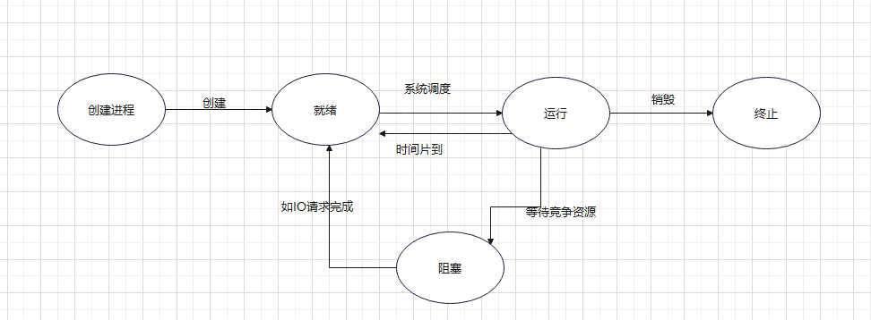

# 文件 I/O 与进程控制 编程笔记

本篇笔记将详细介绍文件 I/O 与进程控制相关的系统调用，从基础到高级，逐一讲解常用函数的概念、语法、参数、使用场景及示例代码。每个部分按函数为单元进行详细讲解，帮助您深入理解每个函数的应用。

## 目录

1. [文件 I/O 基本操作：打开、读写与定位](#一文件-io-基本操作-打开读写与定位)

   * [文件 I/O 基本概念](#1-文件-io-基本概念)
   * [函数 `open`](#2-函数-open)
   * [函数 `read`](#3-函数-read)
   * [函数 `write`](#4-函数-write)
   * [函数 `lseek`](#5-函数-lseek)
   * [函数 `close`](#6-函数-close)
2. [文件锁](#二文件锁)

   * [文件锁的基本概念](#1-文件锁的基本概念)
   * [函数 `fcntl`](#2-函数-fcntl)
   * [函数 `flock`](#3-函数-flock)
3. [异步 I/O](#三异步-io)

   * [异步 I/O 基本概念](#1-异步-io-基本概念)
   * [函数 `aio_read`](#2-函数-aio_read)
   * [函数 `aio_write`](#3-函数-aio_write)
   * [函数 `io_submit` / `io_getevents`](#4-函数-io_submit-io_getevents)
4. [零拷贝 I/O](#四零拷贝-io)

   * [零拷贝 I/O 基本概念](#1-零拷贝-io-基本概念)
   * [函数 `sendfile`](#2-函数-sendfile)
   * [函数 `splice`](#3-函数-splice)
5. [进程的概述与进程号](#五进程的概述与进程号)
   * [进程的定义与状态](#1-进程的定义与状态)
   * [进程号与相关函数](#2-进程号与相关函数)
   * [进程的内存布局](#3-进程的内存布局)
6. [进程创建与执行](#六进程创建与执行)
   * [进程创建与执行的基本概念](#1-进程创建与执行的基本概念)
   * [函数 `fork`](#2-函数-fork)
   * [函数 `vfork`](#3-函数-vfork)
   * [函数 `exec` 系列](#4-函数-exec-系列)
   * [函数 `wait` / `waitpid`](#5-函数-wait-waitpid)
   * [函数 `exit` / `_exit`](#6-函数-exit-_exit)
   * [system 函数](#7-system-函数)
   * [进程终止清理 atexit](#8-进程终止清理-atexit)
   * [僵尸进程与孤儿进程](#9-僵尸进程与孤儿进程)
7. [进程属性](#七进程属性)

   * [进程属性的基本概念](#1-进程属性的基本概念)
   * [函数 `setuid` / `setgid`](#2-函数-setuid-setgid)
   * [函数 `nice` / `setpriority`](#3-函数-nice-setpriority)
8. [综合实例](#八综合实例)

---

## 一、文件 I/O 基本操作：打开、读写与定位

### 1. 文件 I/O 基本概念

文件 I/O 是操作系统提供的一种机制，允许程序与磁盘上的文件进行交互。文件操作通常包括：打开文件、读取数据、写入数据、定位文件指针以及关闭文件。这些操作通常通过一系列系统调用实现，能够帮助程序高效地进行文件读写。

常用的文件 I/O 函数包括：`open`, `read`, `write`, `lseek`, `close` 等。

---

### 2. 函数 `open`

#### 语法

```c
#include <fcntl.h>

int open(const char *pathname, int flags, mode_t mode);
```

#### 参数说明

* `pathname`：要打开的文件路径。
* `flags`：文件打开模式标志，常见的有：

  * `O_RDONLY`：只读模式。
  * `O_WRONLY`：只写模式。
  * `O_RDWR`：读写模式。
  * `O_CREAT`：如果文件不存在，则创建文件。
  * `O_EXCL`：如果文件已经存在，`open` 调用失败。
* `mode`：文件权限，通常使用 `S_IRUSR`, `S_IWUSR` 等标志。

#### 使用场景

`open` 函数用于打开文件并返回一个文件描述符。它是文件操作的起点，常用于读取、写入或修改文件内容。

#### 示例代码

```c
#include <fcntl.h>
#include <unistd.h>
#include <stdio.h>

int main() {
    // 打开文件
    int fd = open("example.txt", O_RDONLY);
    if (fd == -1) {
        perror("open failed");
        return 1;
    }
    printf("File opened successfully with file descriptor: %d\n", fd);
    close(fd);  // 关闭文件
    return 0;
}
```

---

### 3. 函数 `read`

#### 语法

```c
#include <unistd.h>

ssize_t read(int fd, void *buf, size_t count);
```

#### 参数说明

* `fd`：文件描述符，通常通过 `open` 函数获得。
* `buf`：数据缓冲区，用于存储读取的数据。
* `count`：要读取的字节数。

#### 使用场景

`read` 函数用于从文件中读取数据。读取的数据会存储在提供的缓冲区中，函数返回实际读取的字节数。

#### 示例代码

```c
#include <fcntl.h>
#include <unistd.h>
#include <stdio.h>

int main() {
    int fd = open("example.txt", O_RDONLY);
    if (fd == -1) {
        perror("open failed");
        return 1;
    }

    char buffer[128];
    ssize_t bytes_read = read(fd, buffer, sizeof(buffer)-1);
    if (bytes_read == -1) {
        perror("read failed");
        close(fd);
        return 1;
    }

    buffer[bytes_read] = '\0';  // 确保字符串以null结尾
    printf("Read content: %s\n", buffer);
    close(fd);
    return 0;
}
```

---

### 4. 函数 `write`

#### 语法

```c
#include <unistd.h>

ssize_t write(int fd, const void *buf, size_t count);
```

#### 参数说明

* `fd`：文件描述符。
* `buf`：要写入的数据缓冲区。
* `count`：要写入的字节数。

#### 使用场景

`write` 函数用于向文件中写入数据。它会将缓冲区中的数据写入文件，并返回实际写入的字节数。

#### 示例代码

```c
#include <fcntl.h>
#include <unistd.h>
#include <stdio.h>

int main() {
    int fd = open("example.txt", O_WRONLY | O_CREAT, 0644);
    if (fd == -1) {
        perror("open failed");
        return 1;
    }

    const char *data = "Hello, World!";
    ssize_t bytes_written = write(fd, data, strlen(data));
    if (bytes_written == -1) {
        perror("write failed");
        close(fd);
        return 1;
    }

    printf("Written content: %s\n", data);
    close(fd);
    return 0;
}
```

---

### 5. 函数 `lseek`

#### 语法

```c
#include <unistd.h>

off_t lseek(int fd, off_t offset, int whence);
```

#### 参数说明

* `fd`：文件描述符。
* `offset`：偏移量，表示从某个位置的字节数。
* `whence`：起始位置，有以下几种：

  * `SEEK_SET`：从文件开头。
  * `SEEK_CUR`：从当前位置。
  * `SEEK_END`：从文件末尾。

#### 使用场景

`lseek` 用于调整文件的读写指针，允许我们在文件中随机访问特定位置。

#### 示例代码

```c
#include <fcntl.h>
#include <unistd.h>
#include <stdio.h>

int main() {
    int fd = open("example.txt", O_RDWR);
    if (fd == -1) {
        perror("open failed");
        return 1;
    }

    // 将文件指针移动到文件开头
    off_t new_offset = lseek(fd, 0, SEEK_SET);
    if (new_offset == -1) {
        perror("lseek failed");
        close(fd);
        return 1;
    }

    printf("File pointer moved to offset: %ld\n", new_offset);
    close(fd);
    return 0;
}
```

---

### 6. 函数 `close`

#### 语法

```c
#include <unistd.h>

int close(int fd);
```

#### 参数说明

* `fd`：文件描述符。

#### 使用场景

`close` 用于关闭已经打开的文件。当文件操作完成后，调用 `close` 释放资源。

#### 示例代码

```c
#include <fcntl.h>
#include <unistd.h>
#include <stdio.h>

int main() {
    int fd = open("example.txt", O_RDONLY);
    if (fd == -1) {
        perror("open failed");
        return 1;
    }

    // 文件操作
    printf("File opened successfully\n");

    // 关闭文件
    if (close(fd) == -1) {
        perror("close failed");
        return 1;
    }
    printf("File closed successfully\n");

    return 0;
}
```

---

## 二、文件锁

### 1. 文件锁的基本概念

文件锁是用于保证在多进程或多线程环境中，多个进程不会同时对同一文件进行修改。常见的文件锁方式有共享锁（读锁）和独占锁（写锁）。通过锁机制，可以避免文件数据的竞争条件，确保文件的正确性和一致性。

---

### 2. 函数 `fcntl`

#### 语法

```c
#include <fcntl.h>

int fcntl(int fd, int cmd, ...);
```

#### 参数说明

* `fd`：文件描述符。
* `cmd`：控制命令，如 `F_SETLK`, `F_SETLKW`。

#### 使用场景

`fcntl` 可以用于设置或获取文件的各种属性，尤其是用于文件锁的设置。

#### 示例代码

```c
#include <fcntl.h>
#include <unistd.h>
#include <stdio.h>

int main() {
    int fd = open("example.txt", O_WRONLY);
    if (fd == -1) {
        perror("open failed");
        return 1;
    }

    // 设置文件锁
    struct flock lock;
    lock.l_type = F_WRLCK;
    lock.l_whence = SEEK_SET;
    lock.l_start = 0;
    lock.l_len = 0;  // 锁定整个文件

    if (fcntl(fd, F_SETLK, &lock) == -1) {
        perror("fcntl failed");
        close(fd);
        return 1;
    }

    printf("File locked for writing\n");

    close(fd);
    return 0;
}
```

---

### 3. 函数 `flock`

#### 语法

```c
#include <sys/file.h>

int flock(int fd, int operation);
```

#### 参数说明

* `fd`：文件描述符。
* `operation`：锁操作，常见的有 `LOCK_SH`, `LOCK_EX`, `LOCK_UN`。

#### 使用场景

`flock` 提供简单的文件锁接口，适用于较为简单的锁定需求。

#### 示例代码

```c
#include <fcntl.h>
#include <unistd.h>
#include <stdio.h>

int main() {
    int fd = open("example.txt", O_WRONLY);
    if (fd == -1) {
        perror("open failed");
        return 1;
    }

    // 设置文件锁
    if (flock(fd, LOCK_EX) == -1) {
        perror("flock failed");
        close(fd);
        return 1;
    }

    // 文件操作
    write(fd, "Hello, World!", 13);

    // 释放锁
    flock(fd, LOCK_UN);
    close(fd);
    return 0;
}
```

---

## 三、异步 I/O

### 1. 异步 I/O 基本概念

异步 I/O 是指进程可以在发起 I/O 操作后继续执行其他任务，而不会被 I/O 操作阻塞。I/O 操作会在后台执行，完成后通过回调通知进程。这对于高性能、实时系统尤为重要，能够提高应用程序的响应能力。

---

### 2. 函数 `aio_read`

#### 语法

```c
#include <aio.h>

int aio_read(struct aiocb *aiocb);
```

#### 参数说明

* `aiocb`：包含 I/O 操作的相关信息，包括文件描述符、缓冲区、字节数等。

#### 使用场景

`aio_read` 用于异步读取文件或设备的数据。

#### 示例代码

```c
#include <aio.h>
#include <unistd.h>
#include <stdio.h>

int main() {
    struct aiocb cb;
    char buffer[128];
    cb.aio_fildes = open("example.txt", O_RDONLY);
    cb.aio_buf = buffer;
    cb.aio_nbytes = sizeof(buffer);
    cb.aio_offset = 0;

    aio_read(&cb);

    while (aio_error(&cb) == EINPROGRESS);

    printf("Read content: %s\n", (char *)cb.aio_buf);
    close(cb.aio_fildes);
    return 0;
}
```

---

### 3. 函数 `aio_write`

#### 语法

```c
#include <aio.h>

int aio_write(struct aiocb *aiocb);
```

#### 参数说明

* `aiocb`：包含 I/O 操作的相关信息。

#### 使用场景

`aio_write` 用于异步写入数据到文件。

#### 示例代码

```c
#include <aio.h>
#include <unistd.h>
#include <stdio.h>

int main() {
    struct aiocb cb;
    char buffer[] = "Hello, async I/O!";
    cb.aio_fildes = open("example.txt", O_WRONLY | O_CREAT, 0644);
    cb.aio_buf = buffer;
    cb.aio_nbytes = sizeof(buffer) - 1;
    cb.aio_offset = 0;

    aio_write(&cb);

    while (aio_error(&cb) == EINPROGRESS);

    printf("Write completed.\n");
    close(cb.aio_fildes);
    return 0;
}
```

---

### 4. 函数 `io_submit` / `io_getevents`

#### 语法

```c
#include <libaio.h>

int io_submit(io_context_t ctx, long nr, struct iocb **iocbpp);
int io_getevents(io_context_t ctx, long min, long nr, struct io_event *events, struct timespec *timeout);
```

#### 参数说明

* `ctx`：I/O 上下文。
* `nr`：提交的 I/O 操作数量。

#### 使用场景

`io_submit` 用于提交 I/O 操作，而 `io_getevents` 用于获取已完成的 I/O 事件。

---

## 四、零拷贝 I/O

### 1. 零拷贝 I/O 基本概念

零拷贝 I/O 允许数据在文件和网络之间直接传输，而不需要经过用户空间，从而减少内存拷贝操作，提升性能。

---

### 2. 函数 `sendfile`

#### 语法

```c
#include <sys/sendfile.h>

ssize_t sendfile(int out_fd, int in_fd, off_t *offset, size_t count);
```

#### 参数说明

* `out_fd`：输出文件描述符。
* `in_fd`：输入文件描述符。
* `offset`：文件的偏移量。
* `count`：要传输的字节数。

#### 使用场景

`sendfile` 用于将数据从一个文件描述符传输到另一个文件描述符，常用于高效的文件传输。

#### 示例代码

```c
#include <sys/sendfile.h>
#include <fcntl.h>
#include <unistd.h>

int main() {
    int in_fd = open("input.txt", O_RDONLY);
    int out_fd = open("output.txt", O_WRONLY | O_CREAT, 0644);
    off_t offset = 0;
    sendfile(out_fd, in_fd, &offset, 1024);
    close(in_fd);
    close(out_fd);
    return 0;
}
```

---

### 3. 函数 `splice`

#### 语法

```c
#include <fcntl.h>
#include <unistd.h>

int splice(int fd_in, off_t *off_in, int fd_out, off_t *off_out, size_t len, unsigned int flags);
```

#### 参数说明

* `fd_in`：输入文件描述符。
* `fd_out`：输出文件描述符。
* `len`：要传输的字节数。

#### 使用场景

`splice` 用于高效地将文件内容从一个文件描述符传输到另一个文件描述符。

#### 示例代码

```c
#include <unistd.h>
#include <fcntl.h>

int main() {
    int fd_in = open("input.txt", O_RDONLY);
    int fd_out = open("output.txt", O_WRONLY | O_CREAT, 0644);
    splice(fd_in, NULL, fd_out, NULL, 1024, 0);
    close(fd_in);
    close(fd_out);
    return 0;
}
```

---

## 五、进程的概述与进程号

### 1. 进程的定义与状态

**1.程序和进程的区别：** 

​	**程序：是静态的，存放在磁盘上的可执行文件** 

​	**进程：是动态的，是运行在内存中的程序的执行实例**

​	程序是一些指令的有序集合，而进程是程序执行的过程，进程是程序的一次执行过程。 进程的状态是变化的，其包括进程的创建、调度和消亡。 当程序运行时，其就是进程，程序每运行一次，就会创建一个进程。在linux系统中，进程是管理事务的基本单元。 进程拥有自己独立的处理环境和系统资源（处理器、存储器、I/O设备、数据、程序）。

**2.进程的状态及转换**

进程整个生命周期可以简单划分为**三种状态**： 

​	**就绪态：** 进程已经具备执行的一切条件，正在等待分配CPU的处理时间。 

​	**执行态：** 该进程正在占用CPU运行。 

​	**等待态：** 进程因不具备某些执行条件而暂时无法继续执行的状态。

**进程三个状态的转换关系**



引起进程状态转换的具体原因如下：

​	**运行态→等待态**：等待使用资源；如等待外设传输；等待人工干预。

​	**等待态→就绪态**：资源得到满足；如外设传输结束；人工干预完成。

​	**运行态→就绪态**：运行时间片到；出现有更高优先权进程。

​	**就绪态—→运行态**：CPU 空闲时选择一个就绪进程

### 2. 进程号与相关函数

Linux 操作系统提供了三个获得进程号的函数 getpid()、getppid()、getpgid()

```c
#include <sys/types.h>
#include <unistd.h>
pid_t getpid(void);    // 获取当前进程的进程号
pid_t getppid(void);   // 获取当前进程的父进程号
pid_t getpgid(pid_t pid); // 获取指定进程的进程组号
```

**示例代码：**

```c
#include <stdio.h>
#include <sys/types.h>
#include <unistd.h>

int main() {
    printf("pid = %d\n", getpid());
    printf("ppid = %d\n", getppid());
    printf("pgid = %d\n", getpgid(getpid()));
    while(1);
    return 0;
}
```

---

### 3. 进程的内存布局

在程序运行时，内存被分为不同的区域，用来存储代码、数据、堆栈等内容。

1. **栈区（Stack）**：用于存储局部变量、函数参数和返回地址，由系统自动分配和释放。
2. **堆区（Heap）**：用于动态分配内存，由程序员手动分配和释放。
3. **BSS 区**：存放未初始化的全局变量和静态变量，程序加载时自动清零。
4. **数据区**：存放已初始化的全局变量和静态变量。
5. **代码区（Text）**：存储程序的机器指令，只读。

**内存布局示意：**

- 高地址
    - 栈区
    - 堆区
    - BSS 区
    - 数据区
    - 代码区
- 低地址

## 六、进程创建与执行

### 1. 进程创建与执行的基本概念

每个进程都由一个进程号（pid_t）标识。进程的创建和执行是操作系统的核心功能。常用函数有 fork、vfork、exec、wait、waitpid、exit。

---

### 2. 函数 `fork`

#### 语法

```c
#include <sys/types.h>
#include <unistd.h>
pid_t fork(void);
```

#### 返回值
- 父进程中返回子进程的进程号（>0）
- 子进程中返回0
- 失败返回-1

#### 说明
- fork 创建一个新的子进程，子进程是父进程的副本。
- 父子进程拥有独立的地址空间，但初始内容相同（写时拷贝）。

#### 重要示例：区分父子进程

```c
#include <stdio.h>
#include <stdlib.h>
#include <sys/types.h>
#include <unistd.h>
int main(){
    pid_t pid;
    printf(" [%d]:Begin!\n",getpid());
    pid = fork();
    if(pid < 0){
        perror("fork 创建进程错误!");
        exit(1);
    }
    if(pid == 0){
        printf(" [%d]:子进程正在工作...\n",getpid());
    }else{
        sleep(1);
        printf(" [%d]:父进程正在工作...\n",getpid());
    }
    printf("[%d] End!\n", getpid());
    exit(0);
}
```

#### 重要示例：父子进程独立地址空间

```c
#include <stdio.h>
#include <stdlib.h>
#include <unistd.h>
int x = 10;
int main() {
    static int y = 10;
    int z = 10;
    pid_t pid = fork();
    if (pid < 0) {
        perror("创建进程失败");
        return -1;
    }
    if (pid > 0) {
        printf("父进程....\n");
        x++; y++; z++;
        printf("x =%d, y =%d, z =%d\n", x, y, z);
    } else {
        sleep(1);
        printf("子进程...\n");
        printf("x =%d, y =%d, z =%d\n", x, y, z);
    }
    while (1);
    return 0;
}
```

---

### 3. 函数 `vfork`

#### 语法

```c
#include <sys/types.h>
#include <unistd.h>
pid_t vfork(void);
```

#### 说明
- vfork 创建子进程，但父子进程共享地址空间，直到子进程调用 exec 或 exit。
- vfork 后父进程会被挂起，直到子进程退出。

#### 重要示例

```c
#include <stdio.h>
#include <stdlib.h>
#include <sys/types.h>
#include <unistd.h>
int x=100;
int main(){
    static int y=200;
    int z=300;
    pid_t pid = vfork();
    if(pid<0){
        perror("创建进程失败!");
        return -1;
    }
    if(pid>0){
        printf("父进程正在运行中...\n");
        printf("x==%d,y==%d,z==%d\n",x,y,z);
    }else{
        printf("子进程正在运行中...\n");
        x++; y++; z++;
        printf("x==%d,y==%d,z==%d\n",x,y,z);
        exit(0);
    }
    while(1);
    return 0;
}
```

---

### 4. 函数 `exec` 系列

#### 语法

```c
#include <unistd.h>
int execl(const char *path, const char *arg, ...);
int execlp(const char *file, const char *arg, ...);
int execv(const char *path, char *const argv[]);
int execvp(const char *file, char *const argv[]);
int execle(const char *path, const char *arg, ..., char * const envp[] );
int execvpe(const char *file, char *const argv[], char *const envp[]);
```

#### 说明
- exec 系列函数用新程序替换当前进程映像，不会返回（除非出错）。
- execl/execv 需要绝对路径，带 p 的可用相对路径。
- e 变体可自定义环境变量。

#### 重要示例

```c
#include <stdio.h>
#include <stdlib.h>
#include <unistd.h>
#include <sys/types.h>
#include <sys/wait.h>
int main() {
    pid_t pid = fork();
    if(pid < 0) {
        perror("fail to fork");
        exit(1);
    } else if(pid > 0) {
        printf("父进程在运行中\n");
        wait(NULL);
        printf("子进程运行结束\n");
    } else {
        printf("子进程运行中\n");
        if(execl("/bin/ls", "ls", "-l", NULL) == -1) {
            perror("fail to execl");
            exit(1);
        }
    }
    return 0;
}
```

---

### 5. 函数 `wait` / `waitpid`

#### 语法

```c
#include <sys/types.h>
#include <sys/wait.h>
pid_t wait(int *status);
pid_t waitpid(pid_t pid, int *status, int options);
```

#### 说明
- wait 等待任一子进程结束，waitpid 可指定等待的子进程。
- status 可获取子进程退出状态。

#### 重要示例

```c
#include <stdio.h>
#include <stdlib.h>
#include <unistd.h>
#include <sys/types.h>
#include <sys/wait.h>
int main() {
    pid_t pid = fork();
    if(pid < 0) {
        perror("进程创建失败");
        return -1;
    }
    if(pid == 0) {
        for(int i = 0; i < 3; i++) {
            printf("子进程\n");
            sleep(1);
        }
        exit(3);
    } else {
        int status = 0;
        wait(&status);
        if(WIFEXITED(status) != 0) {
            printf("子进程返回状态: %d\n", WEXITSTATUS(status));
        }
        printf("父进程\n");
    }
    return 0;
}
```

---

### 6. 函数 `exit` / `_exit`

#### 语法

```c
#include <stdlib.h>
void exit(int status);
#include <unistd.h>
void _exit(int status);
```

#### 说明
- exit 会刷新缓冲区，_exit 不会。
- 一般推荐用 exit。

---

### 7. system 函数

#### 语法

```c
#include <stdlib.h>
int system(const char *command);
```

#### 说明
- system 用于执行 shell 命令，会创建子进程并等待其结束。

#### 重要示例

```c
#include <stdio.h>
#include <stdlib.h>
int main() {
    system("clear");
    system("ls -l");
    return 0;
}
```

---

### 8. 进程终止清理 atexit

#### 语法

```c
#include <stdlib.h>
int atexit(void (*function)(void));
```

#### 说明
- atexit 注册的函数会在进程正常结束前被调用。

#### 重要示例

```c
#include <stdio.h>
#include <stdlib.h>
void fun1(){ printf("clear fun1...\n"); }
void fun2(){ printf("clear fun2...\n"); }
void fun3(){ printf("clear fun3...\n"); }
int main(){
    atexit(fun1);
    atexit(fun2);
    atexit(fun3);
    printf(" **** **** **** *****\n ");
    sleep(3);
    return 0;
}
```

---

### 9. 僵尸进程与孤儿进程

- **僵尸进程**：进程已经结束, 但进程的占用的资源未被回收, 这样的进程称为僵尸进程。父进程未调用 wait 或 waitpid 函数回收子进程的资源使子进程变为僵尸进程。
- **孤儿进程**: 父进程运行结束, 但子进程未运行结束的子进程。
- **守护进程**: 守护进程是个特殊的孤儿进程, 这种进程脱离终端, 在后台运行。

## 七、进程属性

### 1. 进程属性的基本概念

进程属性控制进程的运行优先级、用户身份等。常见的属性控制函数有 `setuid`/`setgid`、`nice`/`setpriority` 等。

---

### 2. 函数 `setuid` / `setgid`

#### 语法

```c
#include <unistd.h>

int setuid(uid_t uid);
int setgid(gid_t gid);
```

#### 参数说明

* `uid`：新设置的用户 ID。
* `gid`：新设置的组 ID。

---

### 3. 函数 `nice` / `setpriority`

#### 语法

```c
#include <unistd.h>
#include <sys/resource.h>

int nice(int inc);
int setpriority(int which, int who, int priority);
```

#### 参数说明

* `inc` / `priority`：进程优先级的增减或设置值。

---

## 八、综合实例: 构建多进程的 Web 日志切割守护进程

### 🎯 背景场景：网站访问日志分片守护服务

在高并发网站中，Web 服务器（如 Nginx）会不断写入访问日志 `access.log`。为了便于分析和防止单个日志文件过大，我们需要：

* 每隔一段时间（如1分钟）将当前日志复制为 `access_时间戳.log`；
* 使用 **子进程并发复制**，避免阻塞主逻辑；
* 使用 **`flock` 加锁** 防止与 Web 写入冲突；
* 使用 **零拷贝 I/O** 提高效率；
* 该守护程序使用 **异步 I/O** 提前预加载部分数据；
* 设置 **低优先级运行**，避免影响主服务器性能；
* 最终作为后台守护进程运行。

---

## 📘 涉及知识点对照表

| 模块      | 使用函数/机制                                   |
| ------- | ----------------------------------------- |
| 文件操作    | `open`, `read`, `write`, `lseek`, `close` |
| 文件锁     | `flock`（避免写读冲突）                           |
| 异步 I/O  | POSIX AIO（日志头异步加载）                        |
| 零拷贝 I/O | `sendfile` 拷贝大文件                          |
| 进程控制    | `fork`, `waitpid`, `exit`                 |
| 进程属性控制  | `nice`, `setuid`, `setsid`（守护化）           |

---

## 🧪 示例代码：`log_rotator_daemon.c`

```c
#include <stdio.h>
#include <stdlib.h>
#include <unistd.h>
#include <fcntl.h>
#include <string.h>
#include <time.h>
#include <sys/types.h>
#include <sys/stat.h>
#include <sys/sendfile.h>
#include <sys/file.h>
#include <sys/wait.h>
#include <errno.h>
#include <aio.h>
#include <signal.h>

// 日志路径
#define LOG_FILE "access.log"
#define ROTATE_INTERVAL 60  // 秒
#define HEADER_PRELOAD 128  // 异步预加载长度

// 守护进程初始化
void daemonize() {
    pid_t pid = fork();
    if (pid < 0) exit(1);
    if (pid > 0) exit(0); // 父进程退出

    setsid(); // 新会话
    chdir("/");
    umask(0);
    close(STDIN_FILENO);
    close(STDOUT_FILENO);
    close(STDERR_FILENO);
}

// 构造目标文件名
void build_filename(char *buffer, size_t len) {
    time_t t = time(NULL);
    struct tm *tm = localtime(&t);
    strftime(buffer, len, "access_%Y%m%d_%H%M%S.log", tm);
}

// 异步预读日志头部
void preload_header(const char *filepath) {
    int fd = open(filepath, O_RDONLY);
    if (fd < 0) return;

    struct aiocb cb;
    memset(&cb, 0, sizeof(cb));
    char *buf = malloc(HEADER_PRELOAD);
    cb.aio_fildes = fd;
    cb.aio_buf = buf;
    cb.aio_nbytes = HEADER_PRELOAD;
    cb.aio_offset = 0;

    aio_read(&cb);
    aio_suspend((const struct aiocb *const[]){ &cb }, 1, NULL);
    aio_return(&cb); // 清除状态
    free(buf);
    close(fd);
}

// 执行日志切割
void rotate_log() {
    pid_t pid = fork();
    if (pid == 0) {
        // 子进程拷贝
        int in_fd = open(LOG_FILE, O_RDONLY);
        if (in_fd < 0) exit(1);
        flock(in_fd, LOCK_SH); // 共享锁防止写冲突

        char filename[64];
        build_filename(filename, sizeof(filename));
        int out_fd = open(filename, O_WRONLY | O_CREAT | O_TRUNC, 0644);
        if (out_fd < 0) {
            close(in_fd);
            exit(1);
        }

        struct stat st;
        fstat(in_fd, &st);
        sendfile(out_fd, in_fd, NULL, st.st_size);

        flock(in_fd, LOCK_UN);
        close(in_fd);
        close(out_fd);
        exit(0);
    }
}

// 主守护逻辑
int main() {
    daemonize();
    nice(10);  // 降低优先级

    while (1) {
        preload_header(LOG_FILE);  // 异步加载
        rotate_log();              // 子进程拷贝
        sleep(ROTATE_INTERVAL);    // 等待下次
    }

    return 0;
}
```

---

## 🧪 编译与运行

```bash
gcc -o log_rotator_daemon log_rotator_daemon.c -lrt -laio
sudo ./log_rotator_daemon
```

运行后将自动每分钟生成如 `access_20250618_103001.log` 的副本。

---

## ✅ 小结

| 知识点               | 应用方式         |
| ----------------- | ------------ |
| `open/read/write` | 文件打开读取       |
| `flock`           | 并发进程日志文件共享锁  |
| `aio_read`        | 异步加载提高响应     |
| `sendfile`        | 零拷贝提升大文件性能   |
| `fork/waitpid`    | 并发切割子进程管理    |
| `nice`            | 优先级调整避免干扰主业务 |
| `setsid`          | 守护进程脱离终端     |

---