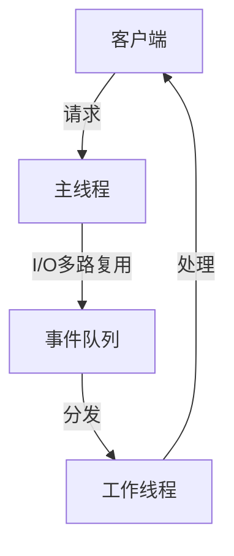

# 四、多路复用与高性能编程

## 目录
- [4.1 多路复用概述](#41-多路复用概述)
- [4.2 select 系统调用](#42-select-系统调用)
- [4.3 poll 系统调用](#43-poll-系统调用)
- [4.4 epoll 高性能I/O](#44-epoll-高性能io)
- [4.5 触发模式与并发模型](#45-触发模式与并发模型)
- [4.6 综合实例](#46-综合实例)

---

## 4.1 多路复用概述

I/O多路复用技术允许单个进程同时监听多个文件描述符，提高了高并发场景下的资源利用率和系统吞吐能力。

#### 主要技术
- **select**：最早的I/O多路复用接口，兼容性好，性能有限
- **poll**：支持更多文件描述符，接口更灵活
- **epoll**：Linux下高性能I/O多路复用方案，适合大规模并发

#### 应用场景
- 高并发网络服务器
- 即时通讯系统
- 实时数据采集

#### 总结
多路复用技术是高性能网络编程的基础，合理选择接口能显著提升系统性能。

---

## 4.2 select 系统调用

select 是最早的I/O多路复用接口，支持监控多个文件描述符的读写状态。

#### 语法
```c
int select(int nfds, fd_set *readfds, fd_set *writefds, fd_set *exceptfds, struct timeval *timeout);
```

#### 参数说明
- `nfds`：待检测的最大文件描述符+1
- `readfds`：需要检测可读事件的描述符集合
- `writefds`：需要检测可写事件的描述符集合
- `exceptfds`：需要检测异常事件的描述符集合
- `timeout`：超时时间，NULL表示无限等待
- **返回值**：就绪描述符数量，超时返回0，失败返回-1并设置errno

#### 使用场景
select 适用于中小规模并发场景，跨平台兼容性好。

#### 示例代码
```c
#include <stdio.h>
#include <sys/select.h>
#include <unistd.h>

int main() {
    fd_set readfds;
    struct timeval timeout;
    int ret;
    
    FD_ZERO(&readfds);
    FD_SET(0, &readfds); // 监控标准输入
    timeout.tv_sec = 5;
    timeout.tv_usec = 0;
    
    ret = select(1, &readfds, NULL, NULL, &timeout);
    if (ret == -1) {
        perror("select failed");
    } else if (ret == 0) {
        printf("超时，无输入\n");
    } else {
        if (FD_ISSET(0, &readfds)) {
            printf("标准输入可读\n");
        }
    }
    return 0;
}
```

#### 总结
select 接口简单，适合入门和兼容性要求高的场景，但性能受限于fd_set大小。

---

## 4.3 poll 系统调用

poll 是select的升级版，支持更多文件描述符，接口更灵活。

#### 语法
```c
int poll(struct pollfd *fds, nfds_t nfds, int timeout);
```

#### 参数说明
- `fds`：指向pollfd结构体数组的指针
- `nfds`：数组元素个数
- `timeout`：超时时间（毫秒），-1表示无限等待
- **返回值**：就绪描述符数量，超时返回0，失败返回-1并设置errno

#### pollfd结构体
```c
struct pollfd {
    int fd;         // 文件描述符
    short events;   // 关注的事件
    short revents;  // 实际发生的事件
};
```

#### 常用事件
- `POLLIN`：可读
- `POLLOUT`：可写
- `POLLERR`：错误

#### 示例代码
```c
#include <stdio.h>
#include <poll.h>
#include <unistd.h>

int main() {
    struct pollfd fds[1];
    int ret;
    
    fds[0].fd = 0; // 标准输入
    fds[0].events = POLLIN;
    
    ret = poll(fds, 1, 5000); // 5秒超时
    if (ret == -1) {
        perror("poll failed");
    } else if (ret == 0) {
        printf("超时，无输入\n");
    } else {
        if (fds[0].revents & POLLIN) {
            printf("标准输入可读\n");
        }
    }
    return 0;
}
```

#### 总结
poll 支持大于1024的fd，适合中等规模并发，接口灵活，性能优于select。

---

## 4.4 epoll 高性能I/O

epoll 是Linux下高性能I/O多路复用接口，适合大规模并发场景。

#### 主要特性
- 支持海量文件描述符（理论上无上限）
- 事件驱动，效率高
- 支持水平触发（LT）和边沿触发（ET）
- 内核与用户空间事件分离，减少无效遍历

#### 相关函数
- `epoll_create`：创建epoll实例
- `epoll_ctl`：注册/修改/删除事件
- `epoll_wait`：等待事件发生

#### 语法
```c
int epoll_create(int size);
int epoll_ctl(int epfd, int op, int fd, struct epoll_event *event);
int epoll_wait(int epfd, struct epoll_event *events, int maxevents, int timeout);
```

#### epoll_event结构体
```c
struct epoll_event {
    uint32_t events; // 事件类型
    epoll_data_t data; // 用户数据
};
```

#### 常用事件
- `EPOLLIN`：可读
- `EPOLLOUT`：可写
- `EPOLLERR`：错误
- `EPOLLET`：边沿触发

#### 示例代码
```c
#include <stdio.h>
#include <sys/epoll.h>
#include <unistd.h>

int main() {
    int epfd = epoll_create(1);
    struct epoll_event ev, events[10];
    ev.events = EPOLLIN;
    ev.data.fd = 0; // 标准输入
    epoll_ctl(epfd, EPOLL_CTL_ADD, 0, &ev);
    int n = epoll_wait(epfd, events, 10, 5000);
    if (n == -1) {
        perror("epoll_wait failed");
    } else if (n == 0) {
        printf("超时，无输入\n");
    } else {
        for (int i = 0; i < n; i++) {
            if (events[i].data.fd == 0) {
                printf("标准输入可读\n");
            }
        }
    }
    close(epfd);
    return 0;
}
```

#### 总结
epoll 是Linux高并发服务器的首选I/O多路复用方案，性能远超select和poll。

---

## 4.5 触发模式与并发模型

### 触发模式
- **水平触发（LT, Level Trigger）**：只要条件满足，事件会一直触发，适合大多数场景，默认模式。
- **边沿触发（ET, Edge Trigger）**：只有状态变化时才触发，效率高但实现复杂，常与非阻塞I/O结合使用。

#### 对比
| 模式 | 特点 | 适用场景 |
|------|------|----------|
| LT   | 简单，易用，兼容性好 | 绝大多数应用 |
| ET   | 高效，减少系统调用 | 高性能服务器，需配合非阻塞I/O |

### 并发模型
- **多进程/多线程**：每个连接分配一个进程/线程，简单但资源消耗大
- **I/O多路复用+单线程**：单线程处理所有连接，节省资源，适合高并发
- **I/O多路复用+线程池**：主线程负责I/O，工作线程处理业务，兼顾性能与扩展性
- **Reactor模型**：事件驱动，主线程分发事件，工作线程处理任务

#### 典型架构


#### 总结
合理选择触发模式和并发模型，是构建高性能网络服务的关键。

---

## 4.6 综合实例

### 实现目标
实现一个基于epoll的高并发TCP回显服务器，支持多客户端并发连接。

### 涉及知识点
- epoll多路复用接口
- 非阻塞I/O
- 事件驱动模型
- 错误处理与资源释放

### 代码实现
```c
#include <stdio.h>
#include <stdlib.h>
#include <string.h>
#include <unistd.h>
#include <sys/socket.h>
#include <netinet/in.h>
#include <arpa/inet.h>
#include <sys/epoll.h>
#include <fcntl.h>

#define PORT 8888
#define MAX_EVENTS 1024
#define BUFFER_SIZE 4096

// 设置非阻塞
int set_nonblocking(int fd) {
    int flags = fcntl(fd, F_GETFL, 0);
    return fcntl(fd, F_SETFL, flags | O_NONBLOCK);
}

int main() {
    int listenfd, connfd, epfd, nready;
    struct sockaddr_in serv_addr, cli_addr;
    socklen_t cli_len = sizeof(cli_addr);
    struct epoll_event ev, events[MAX_EVENTS];
    char buffer[BUFFER_SIZE];

    // 创建监听套接字
    listenfd = socket(AF_INET, SOCK_STREAM, 0);
    set_nonblocking(listenfd);
    serv_addr.sin_family = AF_INET;
    serv_addr.sin_port = htons(PORT);
    serv_addr.sin_addr.s_addr = htonl(INADDR_ANY);
    bind(listenfd, (struct sockaddr*)&serv_addr, sizeof(serv_addr));
    listen(listenfd, 128);

    // 创建epoll实例
    epfd = epoll_create(1);
    ev.events = EPOLLIN;
    ev.data.fd = listenfd;
    epoll_ctl(epfd, EPOLL_CTL_ADD, listenfd, &ev);

    printf("epoll高并发回显服务器启动，监听端口%d\n", PORT);
    while (1) {
        nready = epoll_wait(epfd, events, MAX_EVENTS, -1);
        for (int i = 0; i < nready; i++) {
            if (events[i].data.fd == listenfd) {
                // 新连接
                connfd = accept(listenfd, (struct sockaddr*)&cli_addr, &cli_len);
                set_nonblocking(connfd);
                ev.events = EPOLLIN | EPOLLET;
                ev.data.fd = connfd;
                epoll_ctl(epfd, EPOLL_CTL_ADD, connfd, &ev);
                printf("新客户端连接: %s:%d\n", inet_ntoa(cli_addr.sin_addr), ntohs(cli_addr.sin_port));
            } else if (events[i].events & EPOLLIN) {
                // 可读事件
                int clientfd = events[i].data.fd;
                int n = read(clientfd, buffer, BUFFER_SIZE);
                if (n <= 0) {
                    close(clientfd);
                    epoll_ctl(epfd, EPOLL_CTL_DEL, clientfd, NULL);
                    printf("客户端断开\n");
                } else {
                    write(clientfd, buffer, n); // 回显
                }
            }
        }
    }
    close(listenfd);
    close(epfd);
    return 0;
}
```

### 运行与调试
```bash
# 编译
gcc -o epoll_echo_server epoll_echo_server.c
# 运行
./epoll_echo_server
# 测试（新开多个终端）
telnet 127.0.0.1 8888
```

### 常见问题与解答
- **Q: 为什么epoll比select/poll高效？**
- A: epoll采用事件驱动和内核事件队列，避免无效遍历，支持大规模并发。
- **Q: epoll边沿触发如何避免丢事件？**
- A: 必须使用非阻塞I/O，并循环读取直到EAGAIN。
- **Q: 如何实现高性能并发？**
- A: 结合epoll、线程池、合理的内存管理和高效的业务逻辑。

### 参考资料
- 《UNIX网络编程 卷1：套接字联网API》
- 《Linux高性能服务器编程》
- Linux手册页：select(2), poll(2), epoll(7)
- 相关开源项目：nginx、libevent、libev 